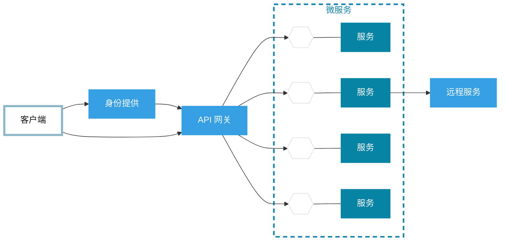
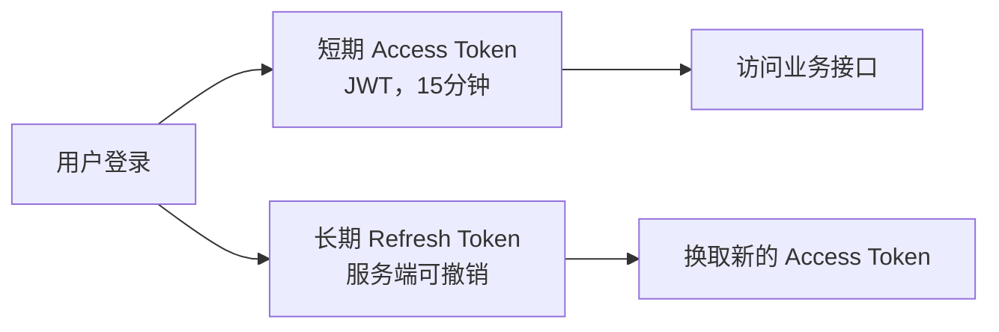

# 互联网架构概念-系统设计面试

```
用户 -> 负载均衡 -> 反向代理 -> 应用服务器集群 -> 数据库中间件 -> 主从数据库服务器+分库分表
└> CDN								└> 分布式缓存Redis
```

单机架构(Single-Node / Monolithic)： 一台服务器同时运行应用和数据库

技术栈示例：LAMP（Linux+Apache+Mysql+PHP）

↓  (问题:应用和数据库争抢资源)

**应用与数据库分离**：应用服务器-专门处理请求、业务逻辑 + 数据库服务器-存数据、IO操作

↓ （高并发来了，比如单机只能100，现在来500个请求，就分散在5台机器）

应用**集群(cluster)**：多台机器，部署**完全一样的代码**。

**负载均衡(Load Balancing)**：让流量合理分配到每台服务器

水平扩展(Horizontal Scaling)：增加 机器 的数量

- 高可用(HA, High Availability)：如果其中一台机器挂掉，可自动调整流量

> 目前只调整了应用层服务器，还没调整数据库服务器

↓ （大量请求仍然直接穿透到数据库, ,数据库成为瓶颈）

> 应用查询数据库的流程：应用 --(查询请求)-> 数据库内存缓冲区 --> 磁盘

使用**缓存(cache)**技术：把原有的内存缓冲区单独拿出来作为中间件，同时放上常被访问的热数据。

三层缓存层架构：

- 浏览器缓存 
- 应用服务器本地缓存 
- 分布式缓存：Redis，单独中间件，独立于应用服务器和数据库服务器

用户每次请求先来浏览器缓存找，再本地缓存，再分布式缓存，最后才到数据库。（绝大数请求在缓存层就被拦住）

缓存放在内存中，查询速度从毫秒级提升到微秒级。就算数据库down了，缓存也能暂时顶住，提高HA。

> 注意：
>
> **数据库缓冲区**：只存原始表数据
>
> **三级缓存结构**：缓存数据多样，只要快、常用即可。还可包括页面接口结果、静态资源等

|（缓存-解决“热点读(Hotspot read)”，但“写请求(write requests)”与“非热点读”还是要访问数据库）

↓ （数据库写慢，写要锁行锁表）

**读写分离(Read-Write Splitting)**：主数据库(Primary/Master)-只负责写，从数据库(Secondary/Slave) - 只负责读。

注意：通过数据同步来保证主从数据一致

> 互联网常为读多写少场景，可以 一主多从，每个从节点各自保存一份完整的数据副本

↓ 数据量剧增，数据库的单库单表 无法保持

**分库分表 (Database Sharding / Partitioning)**：

- 垂直分库(Vertical Database Partitioning) : 按业务拆分 (用户库、商品库、订单库)
- 水平分表(Horizontal Table Partitioning) : 按规则 将一张大表拆成多张小表 (如按UID哈希)

分库分表后，使用 [ 数据库中间件 ]，来保证对应用透明 (应用不需要知道数据库层面的拆分)。

此时数据库从 单点 变成 分布式。存储和并发能力可无限扩展

↓ （全球各地用户访问速度不同、应用服务器暴露在公网危险）

**CDN(Content Delivery Network)**：全球各地部署节点，存放静态资源(html、js、css)。用户每次访问通过域名解析获取到最近的节点IP去取数据。

**反向代理(Reverse Proxy)**：位于用户和应用服务器之间，拦截公网请求，再转发给内网应用服务器。 隐藏真实服务器,做流量清洗和权限校验

↓ （传统数据库难以应对 模糊查询 、全文搜索 、多维统计）（SQL 里的 like 太慢）

**搜索引擎** (如 ElasticSearch)：利用倒排索引实现秒级搜索响应。

**NoSQL数据库** ：存储非结构化/半结构化数据,支持高并发和易扩展

> 当前系统可支持 复杂检索与分析

↓ （单体应用(Monolithic Architecture) 导致：代码耦合严重,修改全量发布、多开发冲突、无法按服务独立扩容）

采用 **分布式架构**：按业务边界拆分为独立系统（如用户系统 商品系统 订单系统），每个系统单独部署、单独发布、单独扩容。

不同系统之间需要通信，使用**RPC (Remote Procedure Call) 远程过程调用**：跨机器服务调用像调本地代码一样简单。

随着服务越多，调用链路越复杂，需要快速找到调用的目标，使用 **服务注册与发现中心 (Service Registry & Discovery)** :管理所有服务地址，新增的服务都要来注册，要如何调用直接来这里查找。

↓ （服务之间相互等待，一旦堵住整条卡死，导致雪崩效应）

**消息队列 (Message queue)**：服务间不直接等待，将消息放入队列。生产者消费者，异步处理。

- 削峰填谷 (Peak Shaving and Valley Filling)：流量突增时暂存请求,按系统能力处理
- 可靠性 ：服务故障时消息不丢失
- 服务解耦

|（分布式架构拆的不够细，比如用户系统里既有登录，又有会员、地址模块等，且不同模块使用的语言可能不一↓  样，如果其中一个模块要修改，又要导致整个系统扩容）

按照一个服务只干一件事，使用 **微服务架构 (Microservices)** ，比如登录服务、支付服务。每个服务都能 独立开发、独立发布、独立扩容，使用各自技术栈。

为了便于定位问题，要升级成 微服务体系，包含：

- 全链路追踪 (Distributed Tracing)：快速定位问题 ，定位慢服务
- 限流、熔断、降级 (Rate Limiting, Circuit Breaking & Fallback)：自动保护系统 
- 服务治理 (Service Governance)：统一监控、日志、权限

优势：极致弹性,独立扩容,故障隔离,开发效率高。可抗住千万级亿级流量

↓ （微服务数量多，从原始一两个应用变成几百个微服务，部署运维复杂）

**容器化和云原生 (Containerization & Cloud Native）**：

- Docker容器 ：把每个服务的代码、依赖配置环境全打包成一个镜像，一次打包到处运行。
- Kubernetes(K8S): 管理几百上千个容器，能进行容器编排，容器自动扩缩容、容器自动重启等 
- 云平台：不用自己搭建机房建服务器，直接租云服务器。按需付费的资源池

成为现代 弹性、自动化、高可用、能无限扩展的架构


> 没有最好的架构，只有**最适合业务**的架构
>
> 架构设计的本质:用**空间换时间**，用**复杂度换性能**
>
> 永远围绕五大目标：高性能、高可用、可伸缩、 可扩展、够安全


# 微服务架构概览

API网关、服务发现、容器化：

所有请求先经过 API网关，自动分配到对应的模块。

服务发现机制 实时定位哪些服务还活着。

容器化 使用 Docker和K8S 把模块打包。



适合微服务的场景：

1. 高并发：比如抢票秒杀，可单独扩容下单模块
2. 多团队协作
3. 快速试错，新功能快速上线


# 大数据场景 (数据仓库)

数据库把表里的每行数据紧挨着存放进磁盘里，属于**行式存储**，适合对单条数据的增删改查。

在业务中，有两种需求，这两种需求如果在同一个数据库里执行会严重阻塞：

- 交易 ：快、准、稳，每次只动几条数据
- 数据分析 ：扫描海量数据做聚合。

**数据仓库** 就是专门做 数据分析 的系统：将同类数据存放在磁盘的一起，比如订单表，按金额、下单时间不同列，各自紧挨着存储。属于 **列式存储**。方便读取某一块磁盘，即知道当天所有下单金额。

**ETL (Extract Transform Load - 抽取-转换-加载)**：把数据从数据库 转移到 数据仓库。 常见ETL工具有 Apache Spark / PySpark、Apache Flink。

- Extract：通过数据库的标准查询接口，拉取数据
- Transform：把脏数据洗干净，比如数据统一成日期格式、去重、补全
- Load：数据仓库按照 分析主题 分层存储，面向日常分析时，会加工底层的各个表格为主题宽表。比如 销售主题宽表 (将订单表 + 支付 + 商品 + 物流表 拼成一张大表)。 这样不用跨好几个表关联查询。

数仓要求 先建模再存储。无法确定用途的原始数据只能丢弃。

**数据湖**：先存储后处理 。 底层用低成本存储介质 (HDD硬盘、对象存储、磁带归档)，结构化、半结构化、非结构化数据全部原样存，不用提前定义表结构。 什么时候需要分析,什么时候再写SQL解析

> 避免 **数据沼泽**

**湖仓一体**：数据仓库查询快、数据准，但贵、装不下非结构化数据。数据湖便宜，能装，但乱,文件无管理、查得慢。 湖仓一体 就是 打通二者，让数据与元数据 无缝互通、按需流动。

所有原始数据先统一入湖，清洗转换后再做 冷热分层 （冷数据、热数据-高频访问），热数据放进数仓，保证查询速度。冷数据转移到成本更低的数据库归档。 数仓可以直接读取湖里的冷数据，冷热数据能联合计算。

**大数据**：针对海量数据的一整套完整技术体系，并非单一工具或架构。目标是 从海量数据里挖出商业价值。

要解决：

- 分布式存储：热数据存储在业务数据库 (如MySQL)，离线分析数据存储在数据仓库，原始数据存储中数据湖

  > HDFS(Hadoop Distributed File System)就是 数据湖 早期经典的底层存储介质

- 分布式计算：把全量数据拆成一个个小分片，分给多台服务器并行计算，最后聚合结果。使用 map()-计算本地分片, reduce()-汇总。 这套框架就是 `MapReduce` ，但计算过程中的中间结果也会存入磁盘，磁盘IO会拖慢速度，只适合对时效性要求不高的离线任务。

  `Spark`把中间结果放在内存里计算，提升速度，成为离线批量计算的绝对主流。

  > `MapReduce` 与 `Spark` 都是批处理，攒一批处理一批。

  `Flink`：天生的流计算框架，数据来一条就处理一条。成为主流的实时数据分析。

- 管理：

  任务调度：定时触发，工具有`Airflow`

  数据治理：保证数据的质量和安全，比如统一口径 监控异常 管控权限

- 应用：

  - 基础应用： BI报表 、数据大屏 （看日常业务数据）

  - 高级应用 ：推荐系统  、风控系统 （算法推动业务增长）

**数据中台**：并非技术，而是管理体系！核心是数据资产化和服务化。 把企业最常用的用户标签、商品指标等 加工成 标准化的数据资产，封装成API接口，让数据变成可以直接被调用的服务。

比如 市场部要做精准营销，不用自己拉数据清洗算标签，直接调用中台的用户标签API，拿到 “近30天浏览过运动鞋的男性用户列表”


# 灰度、蓝绿、滚动发布

核心目标都是**减少停机时间**并**降低线上故障风险**

灰度发布 / 金丝雀发布 (Canary Deployment)：先让小部分真实流量或特定受众访问新版本，观察系统指标与用户反馈，确认稳定后再逐步扩大流量比例。

- 基于比例: 如先切1%流量到新版本,无异常增至10%,再到50%,最后 100%。 
- 基于特征: 通过 HTTP Header、Cookie、用户ID、地域等进行定向路由(如 先面向特定城市白名单放量)。

蓝绿发布 (Blue-Green Deployment)：准备两套完全对等的生产环境，一套对外提供服务，另一套部署新版本，验证无误后一次性全量切换。当前运行版本在**蓝色环境**，新版本部署在闲置的**绿色环境**。在绿色环境完成自动化或人工验证后，通过负载均衡器/路由网关直接将 **100% 流量从蓝切到绿**。若上线后出现严重问题，路由立即切回蓝色环境，实现**秒级回滚**。

滚动发布 (Rolling Update)：在现有集群内部逐批替换旧节点，直到所有实例全部升级为新版本。新节点启动并通过健康检测后接入流量，再继续下一批，直至 10 个节点全部升级完成（如 Kubernetes 的默认升级策略）。发布期间**新旧版本长期共存**，业务逻辑与 API 必须严格保证前后向兼容。故障回滚同样需要逐批替换，回滚耗时相对较长。


# 负载均衡

**负载均衡（Load Balancing）** 是一种将网络访问流量或计算任务分摊到多个操作单元（如服务器集群、网络节点）的技术。

常用的分配策略包括：

- **轮询**：依次分给每台服务器。
- **加权轮询**：性能更强的服务器接收更多请求。
- **最少连接**：分给当前连接数最少的服务器。
- **随机分配**：随机选择服务器。
- **哈希分配**：根据用户 IP、请求参数等固定选择服务器，常用于保持会话。

API 网关收到请求后，通过负载均衡从同一微服务的多个实例中选择一个。网关不需要固定调用某一个实例，而是选择当前合适的实例。

常见实现有 Nginx、HAProxy、LVS，以及云平台提供的负载均衡服务；在微服务系统中，也可以结合 Kubernetes Service 或服务注册与发现机制实现。


# Cookie、Session、Token的区别

**Cookie**：浏览器保存并自动携带的一小段数据。cookie把浏览记录、账户ID等信息存在浏览器本地。但是如果cookie被盗取，就可能被冒充登录。

**Session**：服务器保存的用户会话状态，session用户资料保存在服务器。服务器给每个用户发临时的session_id。

登录成功后，服务器创建一份记录。服务器只把编号 `abc123` 交给浏览器，浏览器通常将它放进 Cookie。发起请求时，由服务器返回对应session_id包含的数据。

> 类比：你拿着取件码(session_id)，真正的东西(session)保存在服务台。

**Token**：用于证明用户身份或权限的凭证，每次请求数据会携带token，在验证token后才会返回数据。JWT是常见实现。靠解密即可验证身份，属于 “无状态验证”。token存储在客户端。


使用场合：

1. 简单就用cookie
2. 要安全场景，必加session（如支付、银行）
3. 高并发首选token


Session 和 JWT 解决的是同一个问题：

> 用户登录一次以后，后续请求如何让系统知道“他是谁”。

假设用户登录后请求“查看订单”。

## 方案一：Session——服务器保存登录状态

登录成功后：

1. 认证服务生成随机编号：`session_id=abc123`

2. 从数据库查询结果中取出必要的信息，创建 Session，把用户信息session保存在 Redis： (一般不会把完整用户资料都存入 Session，只存当前请求经常需要的信息)

   ```text
   abc123 → 用户1001，普通会员
   ```

3. 把 `abc123` 返回给浏览器，通常存在 Cookie 中。

```
首次登录：
用户名和密码 → 查询用户数据库 → 验证成功
                         ↓
               创建 Session 并存入 Redis
                         ↓
                返回 Session ID

后续请求：
Session ID → 查询 Redis → 得到用户身份
```

优点：

- 用户退出时，删除 Redis 中的 Session，立即失效。
- 封禁用户、修改权限容易立即生效。
- 客户端只有随机编号，不包含用户资料。

缺点：

- 每次请求通常都要查 Redis。
- Redis 故障可能影响所有登录用户。
- 系统规模扩大时，需要扩展 Session 存储。

------

## 方案二：JWT——客户端携带登录信息

登录成功后，认证服务生成一个经过签名的 JWT：

```json
{
  "userId": 1001,
  "role": "user",     # 用户角色
  "exp": 1780000000   # JWT 过期时间
}
用户信息 + 有效期 + 服务器防伪签名
```

不过 JWT 中的数据只是经过编码和签名，**默认没有加密**，所以不能放密码、手机号等敏感信息。通常只放用户 ID、角色、权限范围和过期时间。

```
首次登录：
用户名和密码 → 查询用户数据库 → 验证成功
                         ↓
                创建 JWT 并进行签名
                         ↓
                   返回 JWT

后续请求：
携带JWT → 验证签名和有效期 → 从 JWT 中得到用户身份
```

对比：

- Session：
  用户身份放在 Redis
  客户端只拿 Session ID
  后续请求需要查询 Redis
- JWT：
  用户身份放在 JWT 中
  客户端拿完整 JWT
  后续请求通常不查询 Redis


### 在微服务系统中怎么部署？

认证服务用私钥签发 JWT，各个服务使用公钥验证 JWT。

因此各服务不必在每个请求中都询问认证服务：“这个用户是谁？”

优点：

- 适合微服务之间传递身份。
- 各个服务可以独立验证。
- 更容易水平扩展。

缺点：

- JWT 发出去后，在过期前通常仍然有效。
- 用户退出或被封禁时，很难让旧 JWT 立即失效。
- JWT 中的权限可能变旧。
- JWT 体积通常比 Session ID 大。

核心区别是：

| 问题           | Session              | JWT                   |
| -------------- | -------------------- | --------------------- |
| 用户状态在哪里 | 服务器 Redis         | JWT 内                |
| 客户端拿什么   | 随机 Session ID      | 带签名的 JWT          |
| 每次请求怎么办 | 查询 Session         | 验证 JWT              |
| 如何强制下线   | 删除 Session         | 比较困难              |
| 是否适合微服务 | 可以，但依赖共享存储 | 比较适合              |
| 权限变化       | 下次查询即可生效     | 旧 JWT 可能仍是旧权限 |

并不是“全用 Session”或者“全用 JWT”，常见的是混合方案：



- **Access Token**：短期 JWT，用来请求订单、支付等服务。
- **Refresh Token**：服务端保存或可撤销，用来换取新的 JWT。
- 用户退出：撤销 Refresh Token。
- Access Token 即使无法立即撤销，也会在十几分钟后过期。


普通管理后台、传统网站：

> 优先考虑 Cookie + Session + Redis，设计简单，方便强制下线。

移动端、开放 API、大型微服务：

> 常用短期 JWT + Refresh Token。

要求权限立即生效、随时强制下线：

> Session 更直接；或者 JWT 每次仍查询黑名单/用户状态，但这样会损失“无状态”的优势。


# 容灾

RTO：关注系统可用性，“多久能恢复”

RPO：关注数据完整性，“丢了多久的数据”

同城容灾：

- 同城冷备
- 同城热备

同城双活

两地三中心

容灾演练

异地双活

